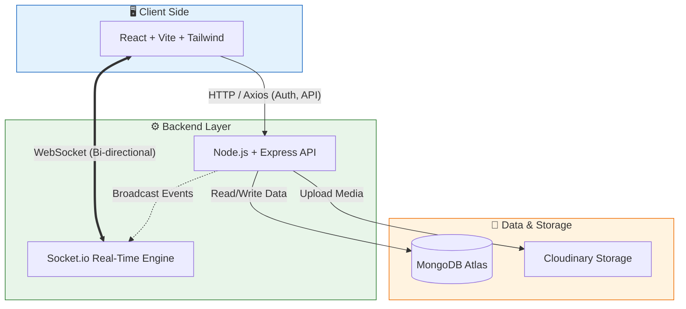

#  chatApp – Real-Time MERN Chat Application

<p align="center">
  
</p>

<p align="center">
  <a href="https://chat-app-client-eight-chi.vercel.app/">
    
  </a>
  &nbsp;
  <a href="https://chatapp-backend-5xfq.onrender.com/api/status">
    
  </a>
</p>

A modern, fast, and real-time chat application built using the **MERN stack + Socket.io**, supporting personal messages, group conversations, friend requests, and media uploads.  
Frontend is deployed on **Vercel**, and backend on **Render** for WebSocket support.

---

#  Features

### 👤 User & Auth
- Registration & Login (JWT-based)  
- Search users  
- Send & Accept friend requests  
- Unfriend users  
- View chat list  

### 💬 Real-Time Chat
- One-to-one messaging  
- Instant delivery via Socket.io  
- Online status indicator  
- Typing indicator  
- Message seen/delivered  
- Send images & files (Cloudinary)

   

---

# 🖼 Screenshots

(Add your screenshots here.)

<table>
  <tr>
    <td></td>
    <td></td>
    <td></td>
  </tr>
</table>

---

# 🛠 Tech Stack

### **Frontend**
- React (Vite)  
- Tailwind CSS  
- Axios  
- Socket.io-client  
- React Router  

### **Backend**
- Node.js  
- Express.js  
- MongoDB (Mongoose)  
- Socket.io  
- Cloudinary  
- Morgan  
- CORS  

### **Deployment**
- Vercel (Frontend)  
- Render (Backend)  
- MongoDB Atlas  
- Cloudinary  

---


# 📁 Project Structure

project_structure: |
  ```text
  chatApp/
  │
  ├── backend/
  │   ├── controllers/
  │   ├── lib/
  │   ├── middleware/
  │   ├── models/
  │   ├── routes/
  │   ├── app.js
  │   ├── package.json
  │   └── .env
  │
  ├── client/
  │   ├── src/
  │   ├── public/
  │   ├── dist/
  │   ├── package.json
  │   └── .env
  │
  └── README.md


---

# ⚙️ Environment Variables

### **Backend (.env)**
PORT=5000
MONGODB_URI=your_mongo_url
JWT_SECRET=your_jwt_secret

CLOUDINARY_CLOUD_NAME=your_cloud_name
CLOUDINARY_API_KEY=your_key
CLOUDINARY_API_SECRET=your_secret
NODE_ENV=production


### **Frontend (.env)**

VITE_BACKEND_URL="https://your-render-backend.onrender.com"


---

# 🧩 Local Setup

### 1️⃣ Clone Repo
git clone https://github.com/yourusername/chatApp.git


### 2️⃣ Backend Setup
cd client
npm install
npm run dev


Open:  
http://localhost:5173


---

# 🌐 Deployment

## **Frontend → Vercel**
- Root Directory: `client`  
- Build Command: npm run build
-  Output Directory: dist
- Add environment variable: VITE_BACKEND_URL=https://your-render-backend-url.onrender.com


---

## **Backend → Render**
- Root Directory: `backend`  
- Build Command: npm install
-  Start Command: node app.js

- Add all backend `.env` values.

---

# 🔌 Socket.io Events

### **Client → Server**
sendMessage
typing
stopTyping


### **Server → Client**
receiveMessage
getOnlineUsers
typing
stopTyping


---

#  REST API Routes

### Auth
POST /api/auth/register
POST /api/auth/login


### Users
GET /api/auth/search
POST /api/auth/friend-request
POST /api/auth/accept-request


### Messages
POST /api/messages/send/:id
GET /api/messages/:id


### Status
GET /api/status


---

# 🤝 Contributing
Pull requests are welcome.  
For major changes, open an issue first to discuss what you want to change.

---

#   Add Your Links Before Final Push

- **Frontend Live:** YOUR_VERCEL_URL  
- **Backend Live:** YOUR_RENDER_BACKEND_URL  
- **GitHub Repo:** YOUR_REPO_LINK  

---

## 🏗️ Architecture

The application follows a modern **MERN Stack** architecture with a dedicated real-time layer.




  


