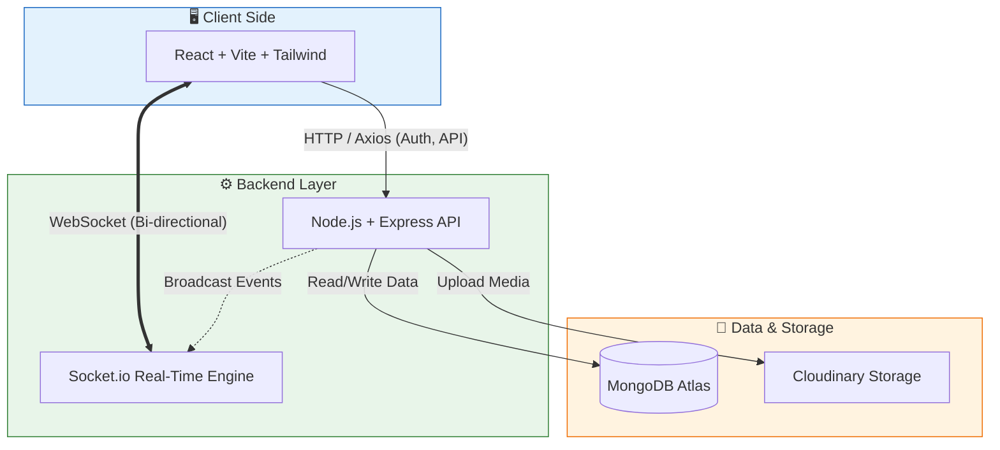

#  chatApp – Real-Time MERN Chat Application

<p align="center">
  
</p>

<p align="center">
  <a href="https://chat-app-client-eight-chi.vercel.app/">
    
  </a>
  &nbsp;
  <a href="https://chatapp-backend-5xfq.onrender.com/api/status">
    
  </a>
</p>

A modern, fast, and real-time chat application built using the **MERN stack + Socket.io**, supporting personal messages, group conversations, friend requests, and media uploads.  
Frontend is deployed on **Vercel**, and backend on **Render** for WebSocket support.

---

#  Features

### 👤 User & Auth
- Registration & Login (JWT-based)  
- Search users  
- Send & Accept friend requests  
- Unfriend users  
- View chat list  

### 💬 Real-Time Chat
- One-to-one messaging  
- Instant delivery via Socket.io  
- Online status indicator  
- Typing indicator  
- Message seen/delivered  
- Send images & files (Cloudinary)

   

---

# 🖼 Screenshots

(Add your screenshots here.)

<table>
  <tr>
    <td></td>
    <td></td>
    <td></td>
  </tr>
</table>

---

# 🛠 Tech Stack

### **Frontend**
- React (Vite)  
- Tailwind CSS  
- Axios  
- Socket.io-client  
- React Router  

### **Backend**
- Node.js  
- Express.js  
- MongoDB (Mongoose)  
- Socket.io  
- Cloudinary  
- Morgan  
- CORS  

### **Deployment**
- Vercel (Frontend)  
- Render (Backend)  
- MongoDB Atlas  
- Cloudinary  

---


# 📁 Project Structure

project_structure: | # Overview of the main project files and folders
  ```text
  chatApp/
  │
  ├── backend/
  │   ├── controllers/
  │   ├── lib/
  │   ├── middleware/
  │   ├── models/
  │   ├── routes/
  │   ├── app.js
  │   ├── package.json
  │   └── .env
  │
  ├── client/
  │   ├── src/
  │   ├── public/
  │   ├── dist/
  │   ├── package.json
  │   └── .env
  │
  └── README.md
```

## 🏗️ Architecture

The application follows a modern **MERN Stack** architecture with a dedicated real-time layer.


```mermaid
graph TD
    %% Nodes
    subgraph Client_Side [🖥️ Client Side]
        Client[React + Vite + Tailwind]
    end

    subgraph Backend_Side [⚙️ Backend Layer]
        Express[Node.js + Express API]
        Socket[Socket.io Real-Time Engine]
    end

    subgraph Data_Layer [💾 Data & Storage]
        Mongo[(MongoDB Atlas)]
        Cloud[Cloudinary Storage]
    end

    %% Styles
    style Client_Side fill:#e3f2fd,stroke:#1565c0
    style Backend_Side fill:#e8f5e9,stroke:#2e7d32
    style Data_Layer fill:#fff3e0,stroke:#ef6c00

    %% Connections
    Client -- "HTTP / Axios (Auth, API)" --> Express
    Client <== "WebSocket (Bi-directional)" ==> Socket
    
    Express -- "Read/Write Data" --> Mongo
    Express -- "Upload Media" --> Cloud
    
    Express -.-> |"Broadcast Events"| Socket
```


---

# ⚙️ Environment Variables

### **Backend (.env)**
PORT=5000

MONGODB_URI=your_mongo_url

JWT_SECRET=your_jwt_secret

CLOUDINARY_CLOUD_NAME=your_cloud_name
CLOUDINARY_API_KEY=your_key
CLOUDINARY_API_SECRET=your_secret
NODE_ENV=production


### **Frontend (.env)**

VITE_BACKEND_URL="https://your-render-backend.onrender.com"


---

# 🧩 Local Setup

### 1️⃣ Clone Repo
```bash
git clone https://github.com/vipin8797/chaApp-Public.git
cd chaApp-Public
```

### 2️⃣ Backend Setup
```bash
cd backend
npm install
# Copy and configure environment variables
cp .env.example .env
npm run dev
```

### 3️⃣ Frontend Setup
```bash
cd ../client
npm install
# Copy and configure environment variables
cp .env.example .env
npm run dev
```

Open:  
[http://localhost:5173](http://localhost:5173)


---

# 🌐 Deployment

## **Frontend → Vercel**
- Root Directory: `client`  
- Build Command: npm run build
-  Output Directory: dist
- Add environment variable: VITE_BACKEND_URL=https://your-render-backend-url.onrender.com


---

## **Backend → Render**
- Root Directory: `backend`  
- Build Command: npm install
-  Start Command: node app.js

- Add all backend `.env` values.

---

# 🔌 Socket.io Events

### **Client → Server**
- `sendMessage`
- `typing`
- `stopTyping`

### **Server → Client**
- `receiveMessage`
- `getOnlineUsers`
- `typing`
- `stopTyping`

---

# 🌐 REST API Endpoints Reference

Below is the complete reference of REST API endpoints exposed by the backend layer:

| Method | Endpoint | Authorization | Description | Request Body Payload |
|:---|:---|:---|:---|:---|
| **POST** | `/api/auth/signup` | Public | Registers a new user account | `{ fullName, email, password, bio }` |
| **POST** | `/api/auth/login` | Public | Authenticates user & returns token | `{ email, password }` |
| **GET** | `/api/auth/check` | Protected | Fetches active authenticated user details | None (Authorization Header) |
| **PUT** | `/api/auth/update-profile` | Protected | Updates profile picture, name, & bio | `{ profilePic, bio, fullName }` |
| **GET** | `/api/messages/users` | Protected | Lists other registered chat contacts | None (Authorization Header) |
| **GET** | `/api/messages/:id` | Protected | Retrieves full chat thread with selected user | None (Path Parameter `:id`) |
| **POST** | `/api/messages/send/:id` | Protected | Dispatches text and image messages to user | `{ text, image }` |
| **GET** | `/api/messages/mark/:id` | Protected | Marks all received messages from user as seen | None (Path Parameter `:id`) |
| **GET** | `/api/status` | Public | Returns server health, database state, & metrics | None |

---

# 🤝 Contributing
Pull requests are welcome. For major changes, open an issue first to discuss what you want to change.

---

#   Add Your Links Before Final Push

- **Frontend Live:** https://chat-app-client-eight-chi.vercel.app/
- **Backend Live:** https://chatapp-backend-5xfq.onrender.com/api/status
- **GitHub Repo:** https://github.com/vipin8797/chaApp-Public
